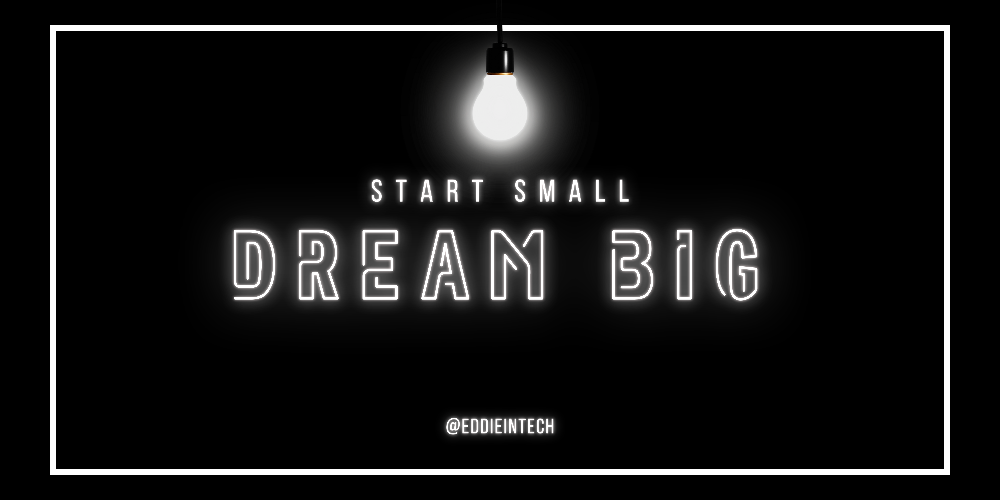
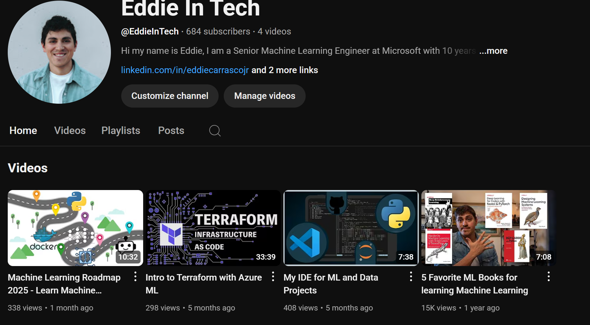

## Hi there 👋

 

I'm a mathematican turned Data Scientist and Software Engineer.

**About me**

- 💼 Machine Learning Engineer at [Microsoft](http://Microsoft.com/)

- 📈 I contribute to tons of AI, ML and Python open source projects.

- ❤️ I love writing Python, and building fun experiments on to test out.

- 💬 Ask me about anything [here](https://github.com/eddiecarrascojr/eddiecarrasojr/issues)

| ------------- | ------------- |

## Top Repositories

### **ML in 2025**
Getting started with AI/ML in 2025. [Here](https://github.com/eddiecarrascojr/ml-in-2025)

### **Azure Verified Modules - Terraform**
Getting started with terraform with Azure. [Here](https://azure.github.io/Azure-Verified-Modules/)

## Youtube Channel
My Youtube Channel can be found [here](https://www.youtube.com/@EddieInTech)

